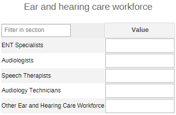
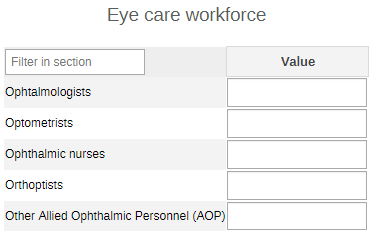
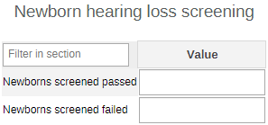
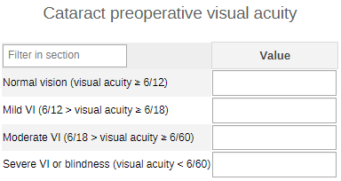
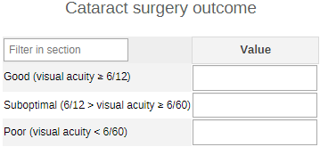
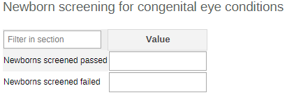
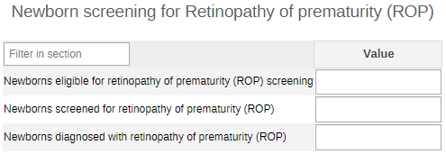

# Sensory Functions: Eye and Ear care - System Design Document {#ncd-sf-design}

## Introduction

The global need for eye and ear care is projected to increase dramatically in the coming decades associated with demographic, behavioural and lifestyle trends. The increase in the number of noncommunicable eye and ear conditions poses a considerable challenge to health systems. To accentuate these challenges, significant inequalities in access to these services exist, being the burden of vision impairment and hearing loss greater in low- and middle-income countries and underserved populations. Strengthening eye and ear care in health systems, by implementing integrated people-centred eye care and integrated people-centred ear and hearing care, is fundamental to respond to the increasing demand and to ensure services availability and affordability for those in need. A key recommendation, by both the [World report on vision](https://apps.who.int/iris/handle/10665/328717) and [World report on hearing](https://apps.who.int/iris/handle/10665/339913) to strengthen eye and ear care in health systems, is to monitor trends and evaluate progress by collecting data relevant to eye and ear care included into the national health information systems.
Routine data from health facilities related to eye and ear care provide information on morbidity, estimates of services utilisation, quality, and coverage to allow management and clinical decision-making. The analysis of this data at national and subnational level provides information on the distribution, availability and coverage of eye and ear care services to inform national planning and decision-making in health policy, management, and clinical care.
Information on the morbidity of eye and ear conditions and interventions to address vision impairment and hearing loss are essential to the decision-making process in eye and ear care at all levels of the health system.

## Background

Eye and ear care service delivery are provided mostly at secondary care level by a multidisciplinary workforce. The indicators selected for routine data from health facility reporting are related to the most common interventions in eye and ear care and relevant features for decision-making.
These indicators aim to support the integration of eye and ear care data into the facility level reporting system. The data provided by these indicators informs the analysis, monitoring and evaluation processes and supports the process of planning and decision-making.
This set of indicators allows to measure service utilisation over time, morbidity information, patterns of quality for interventions, coverage of interventions and workforce distribution. They can also be used to track progress towards the objectives of an operational and/or strategic plan. They are designed to answer eye and ear care monitoring and evaluation questions such as:

- Do eye and ear care services have an adequate workforce and where are the gaps?
- What are the features of utilisation of eye and ear care services regarding the eye and ear conditions, users profile, and functioning (impairment or not)?
- How are eye and ear care services contributing to universal health coverage by providing essential interventions?
- How does eye and ear care effectiveness of interventions evolve in time?
- To what extent do people in need of eye and ear care interventions have access to quality care?

## Purpose

The **Sensory Functions: Eye and Ear Care** System Design document provides an overview of the design principles and guidance used to develop the digital data toolkit for routine aggregate **Eye and Ear care** program reporting in countries HMIS. This document is intended for use by DHIS2 implementers at country and regional level to be able to support implementation and localisation of the toolkit.
The **Sensory Functions Eye and Ear care** metadata toolkit can be adapted to local needs and national guidelines. In particular, local work flows and national guidelines should be considered in the localization and adoption of the programs included in this toolkit.

The data sets have all been based either on WHO recommendations and best-practice examples or published reporting frameworks, such as the [Eye care indicator menu](https://apps.who.int/iris/handle/10665/354257) and [Ear and hearing care: indicators for monitoring provision of services](https://apps.who.int/iris/handle/10665/324936).

These data sets will in many instances have to be adjusted to fit with national reporting systems, to varying degrees. On the one hand, there might be additional variables that are important in a national context which must be added. On the other hand, there might be information that is simply not available for reporting, for example if the data is not captured in the case-based registers at the clinical level.

## System design overview

### Toolkit structure

The **Sensory Functions: Eye and Ear care** program consists of 3 different data sets that can be used at any given time based on the needs of the program:

| Dataset| Description|
|--------|------------|
|**Eye care/Ear and hearing care workforce**|This is a yearly dataset meant to be used where eye care and/or ear care integrated or vertical service is provided and contains information related to the quantity of qualified health personnel present. This data set contains a mostly flat structure. The dataset is designed to report data at the lowest administrative level present in the organisational unit hierarchy.
|**Ear care service delivery**|This is a monthly dataset meant to be used where ear care integrated or vertical service is provided and contains the information enabling the reporting of hearing service delivery KPI. The dataset is designed to report data at the lowest administrative level present in the organisational unit hierarchy.
|**Eye care service delivery**|This is a monthly dataset meant to be used where eye care integrated or vertical service is provided and contains the information enabling the reporting of eye care service delivery KPI. The dataset is designed to report data at the lowest administrative level present in the organisational unit hierarchy.

### Intended users

- **Health facility users**: capture and report key data on Eye and Ear care activities
- **Program managers**: managers at national and sub-national level may be responsible for supporting data entry and analysis.
- **National and local health authorities**: to monitor and analyse the surveillance of data through dashboards and analytics tools, to conduct risk assessments and plan response measures to generate reports for regional and global reporting.
- **Research institutes**: involved with the assessment and improvement of eye and ear care data and information systems.

### Data Set - Eye/Ear care workforce

The Eye/Ear care workforce dataset is splitted in two sections:

- [Ear and hearing care workforce](#ear-and-hearing-care-workforce)
- [Eye care workforce](#eye-care-workforce)

#### Ear and hearing care workforce

This section collects the numbers of the following ear care workforce:

- **ENT Specialists**: refers to medical doctors who have received training in managing diseases of the ear, nose and throat through a recognized degree or diploma course.
- **Audiologists**: refers to a person having undergone a recognized degree or diploma course in audiology.
- **Speech Therapists**: refers to a person having a recognized diploma or degree in speech therapy. In some countries, Speech therapy is a part of audiology training.
- **Audiology Technicians**: refers to a person who supports hearing care service provision by performing routine screening tests of patients, fitting, and adjusting hearing aids, and answering questions for patients regarding their hearing devices.
- **Other ear and hearing workforce**: besides the cadres of service providers mentioned above, many others who play a significant role in the provision of hearing care include audiometrists, hearing aid dispensers, rehabilitation specialists, and community health workers trained in ear and hearing care.

These professions have been selected in line with the [WHO Ear and hearing care: situation analysis tool](https://apps.who.int/iris/handle/10665/206141) to allow comparability. The definition includes those working in public, private for-profit and private not-for-profit sectors.

#### Eye care workforce

According to the [WHO Eye care competency framework](https://apps.who.int/iris/handle/10665/354241), this section collects numbers of the following eye care workforce:

- **Ophthalmologists**: specialist medical practitioners that diagnose, treat, and perform non-surgical and/or surgical procedures on people with vision disorders and eye conditions and rehabilitative care of people with permanent visual impairment.
- **Optometrists**: person with a recognized diploma or degree in optometry that provides detection/ diagnosis, management, and treatment services for disorders of the eye and visual system.
- **Ophthalmic nurses**: specialist nurses trained to assist in the diagnostic evaluation, treatment, management, and care of patients with deficiencies and abnormalities that affect their vision and the visual system. May also be called an Ophthalmic clinical officer/Ophthalmic clinician.
- **Orthoptists**: person with a recognized diploma or degree in orthoptics trained to evaluate and treat disorders of the visual system with an emphasis on binocular vision and eye movement disorders.
- **Other allied ophthalmic personnel**: umbrella term often used to describe other eye care workers (e.g. Ocularist, Ophthalmic assistant, Optical dispenser, Optician, Vision therapist, among others) that assist in the diagnostic evaluation, treatment, management, and care of patients with deficiencies and abnormalities that affect their vision and the visual system.

These professions have been selected in line with the [WHO Eye Care Situation Analysis Tool](https://apps.who.int/iris/handle/10665/356021) to allow comparability. The definition includes those working in public, private for-profit and private not-for-profit sectors.

>**Note**
>
>- Both eye and ear care workforce have been included in the same dataset but should be adapted prior implementation according to the service implemented.
>- The information should be reported at the end of the year and then updated accordingly to the personnel movements.
>- The periodicity should be adapted to context implementation especially where there is high turnover and/or important variation of personnel.

### Data Set - Ear care service delivery

The Ear care service delivery data set is split in six sections:

- [Volume of hearing and ear care consultations](#volume-of-hearing-and-ear-care-consultations)
- [Ear conditions](#ear-conditions)
- [Hearing loss](#hearing-loss)
- [Hearing technologies adoption](#hearing-technologies-adoption)
- [Mastoid surgery](#mastoid-surgery)
- [Newborn hearing loss screening](#newborn-hearing-loss-screening)

#### Volume of hearing and ear care consultations

The age category (0-17, 18-49, 50 years) is common throughout the data set and reduces the number of data elements to be reported.
The total of first and follow-up visits should provide a real overall volume of patients attending the service.

#### Ear conditions

Only the new cases should be recorded enabling the prevalence calculation of the ear conditions among visits and population.
The description of each ear condition, with the associated ICD-11 code and category, can be found on the [SF Metadata Reference File](add link here), as below:

|Ear conditions | Brief definition | ICD-11 codes|
|---------------|------------------|-------------|
|Acute otitis media|Inflammation of the middle ear which erupts suddenly and passes quickly. It is characteristic to have a middle-ear infection behind a reddened eardrum.|Acute otitis media: AB00    Acute suppurative otitis media: AA90|
|Chronic nonsuppurative otitis media|Synonymous with otitis media with effusion (OME).  It typically lingers following acute otitis media, when the fluid in the ear, formed by the infection, does not clear spontaneously. The tympanic membrane is intact, but the middle ear is liquid- fluid filled.|Nonsuppurative otitis media: AA80 to AA83; AA8Z; and AB17|
|Chronic suppurative otitis media (excluding cholesteatoma)|Long-standing infection of the middle ear, usually for longer than 2 weeks. This involves a perforation (hole) in the tympanic membrane and active bacterial infection within the middle ear space for several weeks or more. There may be enough pus that it drains to the outside of the ear (otorrhea), or the purulence may be minimal enough to only be seen on examination using a binocular microscope, unspecified.|Chronic suppurative otitis media: AA91 and AB0Y|
|Cholesteatoma of middle ear|Problem in the middle ear when the skin of the eardrum grows into the middle ear. People with cholesteatoma might have foul smelling ear discharge and hearing loss.|Cholesteatoma of middle ear: AB12|
|Other ear condition|Dry perforation of the tympanic membrane, tympanosclerosis, adhesive middle ear disease, otosclerosis and tumours of the ear.||

#### Hearing loss

The information collected are the number of hearing loss cases by degree (mild, moderate-moderately severe, and severe or higher hearing loss) diagnosed among the first visits disaggregated by age category and type of hearing loss (sensorineural, conductive, or mixed).

A combined age/hearing loss type category (sensorineural, conductive, mixed) reduces the number of data elements enhancing the possibility of more comprehensive analysis.

A brief definition of the types and grades of hearing loss and hearing technologies can be found on the [SF Metadata Reference File](add link here), as below:

|Hearing loss|Brief definition|
|------------|----------------|
|Type|**Sensorineural**: Type of hearing loss in which the root cause lies in the vestibulocochlear nerve (Cranial nerve VIII), the inner ear, or central processing centres of the brain.   **Conductive**: Occurs when there is a problem conducting sound waves anywhere along the route through the outer ear, tympanic membrane (eardrum), or middle ear (ossicles).  **Mixed**: This diagnosis refers to a mix of both conductive and sensorineural hearing loss.|
|Grades|**Mild hearing loss**: Hearing threshold in better hearing ear 20-34 decibels (dB).  **Moderate-moderately severe hearing loss**: Hearing threshold in better hearing ear 35-64 dB.  **Severe or higher hearing loss**: Hearing threshold in better hearing ear 65dB or above.|

#### Hearing technologies adoption

This section is divided in two units:

- Total cases of people fitted with hearing technologies who came to the facility for follow-up sessions within six months of fitting in the reporting period by age category
- Number of hearing technologies fitting, as aid technologies or implants, disaggregated by age category and type of hearing loss (sensorineural, conductive, or mixed).

A brief definition of the hearing technologies can be found on the [SF Metadata Reference File](add link here), as below (for the type of hearing loss definition, please refer to the previous table):

|Hearing technologies|Brief description|
|--------------------|-----------------|
|Hearing aid technologies|Devices that amplify and deliver sound to the ear in order to improve auditory function. They can be analogue or digital.|
|Implant technologies fitting|**Cochelar implants**: Surgically implanted device that works by transducing acoustic energy into an electrical signal, which is used to stimulate auditory nerve fibres.   **Bone conduction implants**: Transmit sound to the inner ear through the bones of the skull, bypassing the middle ear.  **Active middle ear implants**: Fully or partially implanted in the ear. They function by converting sound into kinetic energy, which directly vibrates the middle ear ossicles or transmits the vibrations to the inner ear.|

#### Mastoid surgery

The *Waiting days for mastoid surgery of middle ear cholesteatoma* need to count the waiting days for the patient with middle ear cholesteatoma surgery performed during the reporting period **including** the ones that were visited on previous months but the surgery was performed on the reporting period and **excluding** the ones visited to the reporting period but with surgery not performed.

#### Newborn hearing loss screening

Number of newborns and/or infants who were born at the facility and screened for hearing loss prior to discharge from the facility. Cases should be disaggregated by screening results as *'passed'* (hearing loss has not been detected or suspected) or *'failed'* (hearing loss detected or suspected).

No disaggregation on the provenance of the newborn screened is present as only the newborn borned on the health facility during the reporting period should be recorded (the denominator used on the *Coverage of newborn screening for hearing loss* indicator is the data element *Live births in facility* collected on the RMNCAH dataset).

### Data Set - Eye care service delivery

The eye care service delivery data set is splitted in eight sections:

- [Volume of eye care consultations](#volume-of-eye-care-consultations)
- [Eye conditions](#eye-conditions)
- [Cataract surgery](#cataract-surgery)
- [Cataract preoperative visual acuity](#cataract-preoperative-visual-acuity)
- [Cataract surgery outcome](#cataract-surgery-outcome)
- [Newborn screening for congenital eye conditions](#newborn-screening-for-congenital-eye-conditions)
- [Newborn screening for Retinopathy of prematurity (ROP)](#newborn-screening-for-retinopathy-of-prematurity-rop)
- [Diabetic retinopathy screening](#diabetic-retinopathy-screening)

#### Volume of eye care consultations

Total cases of first and total cases of follow-up visits for hearing and ear care consultations, disaggregated by age category. The total of first and follow-up visits should provide a real overall volume of patients attending the service.

The age category (0-17, 18-49, 50 years) is common throughout the dataset and reduces the number of data elements to be reported.

#### Eye conditions

Only the new cases should be recorded enabling the prevalence calculation of the eye conditions among visits and population.

A combined age/vision status category reduces the number of data elements enhancing the possibility of more comprehensive analysis. Typically, the classification of vision impairment is based on the measure of visual acuity in one or both eyes.

For this purpose, the threshold for defining vision impairment is:

- Normal vision: visual acuity better or equal than 6/12 in one or both eyes
- Vision impairment or blindness: visual acuity worse than 6/12 in one or both eyes

The description of each eye condition, with the associated ICD-11 code and category, can be found on the [SF Metadata Reference File](add link here), as below:

|Eye condition|Brief definition|ICD-11 codes|
|-------------|----------------|------------|
|Refractive error|Due to an abnormal shape or length of the eyeball, light does not focus on the retina resulting in blurred vision. There are several types of refractive error: myopia, hyperopia, astigmatism, or presbyopia.|Disorders of refraction: 9D00
|Cataract|Clouding of the lens of the eye, which impedes the passage of light.|Disorders of lens - Cataract: 9B10|
|Vitreoretinal disorders|Any condition affecting the retina or the vitreous.|Disorders of the retina: 9B70 to 9B78; 9B7Y; and 9B7Z   Disorders of the vitreous body: 9B80 to 9B84; 9B8Y; and 9B8Z|
|Glaucoma|Progressive damage to the optic nerve. Initially, loss of vision occurs in the periphery and can progress to severe vision impairment.|Glaucoma or glaucoma suspect: 9C60; 9C61; 9C6Y; and 9C6Z|
|Disorders of the ocular surface, eyelid, and lacrimal system |Conditions affecting the cornea, the conjunctiva, eyelid, or lacrimal apparatus.|Disorders of conjunctiva: 9A60 to 9A62; 9A6Y; and 9A6Z  Disorders of cornea: 9A70 to 9A79; 9A7Y; and 9A7Z  Disorders of eyelid or peri-ocular area: 9A00 to 9A06; 9A0Y; and 9A0Z  Disorders of lacrimal apparatus: 9A10; 9A11; 9A1Y; and 9A1Z|
|Ocular trauma|Traumatic injuries or contusions to the eyeball, orbit or surrounding tissue, including foreign body in multiple parts of the external eye|Traumatic injury to eyeball: NA06
|Other eye condition

#### Cataract surgery

Number of cataract surgeries performed counts the total number of ***cataract operated eyes*** in the facility in the reporting period.

The *Waiting days for cataract surgery* need to count the waiting days for the patient with cataract surgery performed during the reporting period **including** the ones that were visited in previous reporting periods but the surgery was performed on the reporting period and **excluding** the ones visited in the reporting period but with surgery not performed on the reporting period.

#### Cataract preoperative visual acuity

According to the preoperative presenting visual acuity of cataract operated eyes, ***number of eyes*** with:

- **Normal vision**: visual acuity better or equal than 6/12
- **Mild vision impairment**: visual acuity worse than 6/12 but equal to or better than 6/18
- **Moderate vision impairment**: visual acuity worse than 6/18 but equal to or better than 6/60
- **Severe vision impairment or blindness**: visual acuity worse than 6/60

#### Cataract surgery outcome

According to the postoperative presenting visual acuity of cataract operated eyes, ***number of eyes*** with a cataract surgery outcome:

- **Good**: attaining a postoperative presenting visual acuity of 6/12 or better
- **Suboptimal**: attaining a postoperative presenting visual acuity worse than 6/12, and equal to or better than 6/60
- **Poor**: attaining a postoperative presenting visual acuity worse than 6/60

>**Note**
>
>Visual acuity is measured for distance. Presenting visual acuity is the measure of unaided vision or, if spectacles or contact lenses are worn to the assessment, visual acuity is measured with the person wearing them. Postoperative visual acuity should be tested between 4 and 12 weeks postoperatively. Settings with poor follow-up after cataract surgery should consider early postoperative assessment of visual acuity.

>**Caution**
>
> In the cataract related section [cataract surgery](#cataract-surgery), [cataract preoperative visual acuity](#cataract-preoperative-visual-acuity) and [cataract surgery otucome](#cataract-surgery-outcome) the information to be reported are the eye operated and not the patients.

#### Newborn screening for congenital eye conditions

No disaggregation on the provenance of the newborn screened is present as only those born on the health facility during the reporting period should be recorded (the denominator used on the '*Coverage of newborn screening for congenital and neonatal eye conditions'* indicator is '*Live births in facility*' collected on the [RMNCAH program](https://docs.dhis2.org/en/topics/metadata/rmncah/design.html)).

#### Newborn screening for Retinopathy of prematurity (ROP)

The eligibility for ROP screening is related to the birthweight and gestational age, with or without additional sickness criteria, and is determined by local guidelines.

The information on the '*Newborns eligible for retinopathy of prematurity (ROP) screening*' data element is normally collected on the RMNCAH services. According to local guidelines, it can comprise preterm newborns, low birth weight newborns or newborns admitted to neonatal intensive care units.

#### Diabetic retinopathy screening

Number of people with diabetes referred for diabetic retinopathy screening in the facility and from those the ones that have been clinically screened for diabetic retinopathy in the facility.0

## Analytics and indicators

Hereunder you can find the core indicators with their DHIS2 counterpart and disaggregation used on the conceptualization of the toolkit

### Eye care services

|Core indicators|DHIS2 Indicators|Disaggregation|
| --------------|----------------|--------------|
|Ratio of eye care workforce per 10,000 in population by professions|SF - Eye care workforce SF - Eye care workforce (/10000 pop)|Profession|
|Proportion of population utilizing Eye Care services by selected eye condition categories (ICD code or equivalent) in the facility|SF - Refractive Error (%) SF - Cataract (%) SF - Vitreoretinal Disorders (%) SF - Glaucoma (%) SF - Disorders of the Ocular Surface, Eyelid Lacrimal System (%) SF - Ocular Trauma (%) SF - Other eye conditions (%)|Vision impairment Age|
|Average waiting time for cataract surgery from first registration for the surgery to the surgery itself in the facility|SF - Average waiting time for cataract surgery||
|Proportion of preoperative visual acuity among persons with cataract by visual acuity categories|SF - Normal vision (%) SF - Mild VI (%) SF - Moderate VI (%) SF - Severe VI or blindness (%)||
|Proportion of cataract surgical outcomes (visual acuity) among persons who were operated by visual acuity categories|SF - Good (%) SF - Suboptimal (%) SF - Poor (%)||
|Coverage of periodic eye screening among persons with diabetes in the facility|SF - Diabetic retinopathy screening (%)||
|Coverage of newborn screening for congenital and neonatal eye conditions in the facility|SF - Newborns screened for congenital and neonatal eye condition (%)|Output|
|Coverage of retinopathy of prematurity (ROP) screening among eligible infants admitted to neonatal intensive care according to national guidelines|SF - Newborns screend for retinopathy of prematurity (ROP) (%)|Output|

### Ear and hearing care service

|Core indicators|DHIS2 Indicators|Disaggregation|
| --------------|----------------|--------------|
|Ratio of ear and hearing care workforce per 10,000 in population by professions|SF - Ear and hearing care workforce SF - Ear and hearing care workforce (/10000 pop)|Profession|
|Coverage of newborn screening for hearing loss|SF - Newborns screened for hearing loss (%)|Output|
|Proportion of population utilizing Ear and Hearing Care services by selected ear condition categories (or ICD codes) in the facility (ICD or equivalent)|SF - Acute otitis media (%) SF - Chronic nonsuppurative otitis media (%) SF - Chronic suppurative otitis media (excluding cholesteatoma) (%) SF - Cholesteatoma of middle ear (%) SF - Other ear condition (%)||
|Proportion of diagnosed hearing loss among persons accessing Ear and Hearing Care services by hearing loss categories|SF - Hearing loss cases (%) SF - Sensorineural hearing loss type (%) SF - Conductive hearing loss type (%) SF - Mixed hearing loss type (%)|Degree of hearing loss Age|
|Average waiting time for mastoid surgery for middle ear cholesteatoma from first registration for the surgery to the surgery itself|SF - Average waiting days for mastoid surgery for middle ear cholesteatoma||
|Proportion of persons with diagnosed hearing loss who use hearing technologies|SF - Hearing technologies fitting (%)|Technologies|
|Proportion of persons who came for follow-up sessions after being fitted with hearing technology|SF - Timely follow-up visit of hearing aid & implant technologies fitting||

Addition indicators no listed on the above tables have been included on the dashboards to improve the analysis of vision and eye care and ear and hearing care services.

The full list of indicators and indicator groups is available in the [SF Metadata Reference File](add link here).

There are two data elements used as denominators of some indicators that have been 'borrowed' from other programs and are not present on the SF data model, as:

- **GEN - Population**: used on the indicators for both hearing and eye care service accessibility by disease
- **RMNCAH - Live births in facility**: used on the indicators for coverage of both screening of hearing loss and congenital / neonatal eye conditions

## Validation rules

The full list of validation rules that have been set-up to ensure the quality of data are available in the [SF Metadata Reference File](add link here).

## Dashboards

The dashboards and their items (charts, maps and tables) has been designed for national, subnational (district) and health facility level analysis according to the intended use and users.

[### SF - 01 - Ear care service delivery - Health facility](add link here)

A health facility level dashboard using charts to present the data on ear and hearing care service utilisation (volume of consultations, conditions and hearing loss cases), delivery of hearing technologies to persons with hearing loss, mastoid surgery for middle ear cholesteatoma waiting times and proportion of newborns screened for hearing loss.

[### SF - 02 - Eye care service delivery - Health facility](add link here)

A health facility level dashboard using charts to present the data on eye care service utilisation (volume of consultations and conditions), cataract surgery waiting times, preoperative visual acuity, and visual outcome, proportion of diabetic retinopathy screening, proportion of newborns screened for congenital and neonatal eye conditions and proportion of retinopathy of prematurity screening and diagnosis.

[### SF - 03 - Ear care service delivery - Subnational](add link here)

A subnational level dashboard that uses charts, pivot tables and maps to illustrate subnationally the ear and hearing care service utilisation (volume of consultations, conditions and hearing loss), provision and distribution of mastoid surgery for middle ear cholesteatoma, and proportion of newborns screened for hearing loss and the distribution of these services at subnational level.

[### SF - 04 - Eye care service delivery - Subnational](add link here)

A subnational level dashboard that uses charts, pivot tables and maps to illustrate subnationally the eye care service utilisation (volume of consultations, conditions and vision impairment/blindness), provision, distribution and waiting times for cataract surgery services, and proportion of newborns screened for congenital and neonatal eye conditions and the distribution of these services at subnational level.

[### SF - 05 - Eye care workforce](add link here)

A national and subnational level dashboard that illustrates the availability of eye care workforce. Charts are used to provide the absolute numbers and ratio of the eye care workforce and the disaggregation according to the profiles. Maps are used to show the distribution of the workforce and the average caseload.

[### SF - 06 - Ear and hearing workforce](add link here)

A national and subnational level dashboard that illustrates the availability of eye care workforce. Charts are used to provide the absolute numbers and ratio of the eye care workforce and the disaggregation according to the profiles. Maps are used to show the distribution of the workforce and the average caseload.

## User groups

As part of the package configuration, user groups have been created to be used to manage sharing settings in the metadata for all the modules. Core metadata that use these sharing settings include mainly the dataSets, dashboard, indicators and data Elements.

The three user groups created include:

|User group|Dashboard|Program metadata|Program data|
|----------|---------|----------------|------------|
|**SF - Admin**|Can edit and view|Can edit and view|No access|
|**SF - Access**|Can edit and view|Can view only|Can view only|
|**SF - Data capture**|No access|Can view only|Can capture and view|

## References

World Health Organization. (2019). World report on vision. World Health Organization. Available at <https://apps.who.int/iris/handle/10665/328717>.

World Health Organization. (2021). World report on hearing. World Health Organization. Available at <https://apps.who.int/iris/handle/10665/339913>.

World Health Organization. (2022). Eye care indicator menu (ECIM): a tool for monitoring strategies and actions for eye care provision. World Health Organization. Available at <https://apps.who.int/iris/handle/10665/354257>.

World Health Organization. (2019). Ear and hearing care: indicators for monitoring provision of services. World Health Organization. Available at <https://apps.who.int/iris/handle/10665/324936>.

World Health Organization. (2022). Eye care competency framework. World Health Organization. Available at <https://apps.who.int/iris/handle/10665/354241>.

World Health Organization. (2022). Eye care situation analysis tool (ECSAT). World Health Organization. Available at <https://apps.who.int/iris/handle/10665/356021>.

World Health Organization. (2015). Ear and hearing care: situation analysis tool. World Health Organization. Available at <https://apps.who.int/iris/handle/10665/206141>.

World Health Organization. (2022). WHO recommendations on maternal and newborn care for a positive postnatal experience. World Health Organization. Available at  <https://apps.who.int/iris/handle/10665/352658>.

